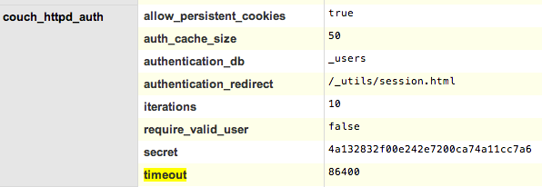

# CodeSwarm

## Install

Checkout plugin `codeswarm-node`:

```
$ cd projects
$ git clone git@github.com:CodeSwarm/codeswarm-node.git
$ cd codeswarm-node
$ npm link
```

Checkout plugin `codeswarm-sauce`:

```
$ cd projects
$ git clone git@github.com:CodeSwarm/codeswarm-sauce.git
$ cd codeswarm-sauce
$ npm link
```

Checkout plugin `codeswarm-plato`:

```
$ cd projects
$ git clone git@github.com:CodeSwarm/codeswarm-plato.git
$ cd codeswarm-plato
$ npm link
```

Checkout plugin `codeswarm-gateway`:

```
$ cd projects
$ git clone git@github.com:CodeSwarm/codeswarm-gateway.git
$ cd codeswarm-gateway
$ npm link
```

Link them:

```
$ cd  projects/codeswarm
$ npm link codeswarm-node
$ npm link codeswarm-sauce
$ npm link codeswarm-plato
```

## Run

Start CodeSwarm in dev mode (uses nodemon to restart when JS changes are made):

```bash
$ npm run mon
```


## CouchDB Setup

You have to create the admin user with the `admin` password. You can override this with the COUCHDB_USERNAME and COUCHDB_PASSWORD env vars though.

To add the couchdb admin user go to futon (the couchdb admin interface), and click on the `Setup more admins` on the bottom right side.
On the couchdb configuration, set couchdb_httpd_auth=> allow_pesistent_cookies to true
Make sure the admin user is listed on the config `admins` section

Using a different user on the fronted than the admin user and also the persistent cookie session should prevent you from being logged out.

### Session timeout

To define / redefine the session timeout you need to specify the `timeout` parameter of the `couch_httpd_auth` section of the configuration, in seconds:



### ENV Variables

* COUCHDB_URL - couchdb url, defaults to "http://localhost:5984".
* COUCHDB_USERNAME - couchdb username, defaults to "admin".
* COUCHDB_PASSWORD - couchdb password, defaults to "admin".
* PORT - http listening port, defaults to 1337.
* GITHUB_CLIENT_ID
* GITHUB_CLIENT_SECRET
* GITHUB_CALLBACK_URL - github callback, default to "http://localhost:1337/tokens/github/callback"
* VOUCH_REMOTE or CODESWARM_REMOTE - remotified, defaults to "false".

## Admin rights

In order to add foreign projects (projects you are not a github admin of), you need to bead admin rights.

To give a user admin rights go to the `_users` database in CouchDB and edit the relevant user.
Edit the `roles` attribute and add an `admin` value to it. Save the user document.

The user must logout and login in order to get the privileges.
